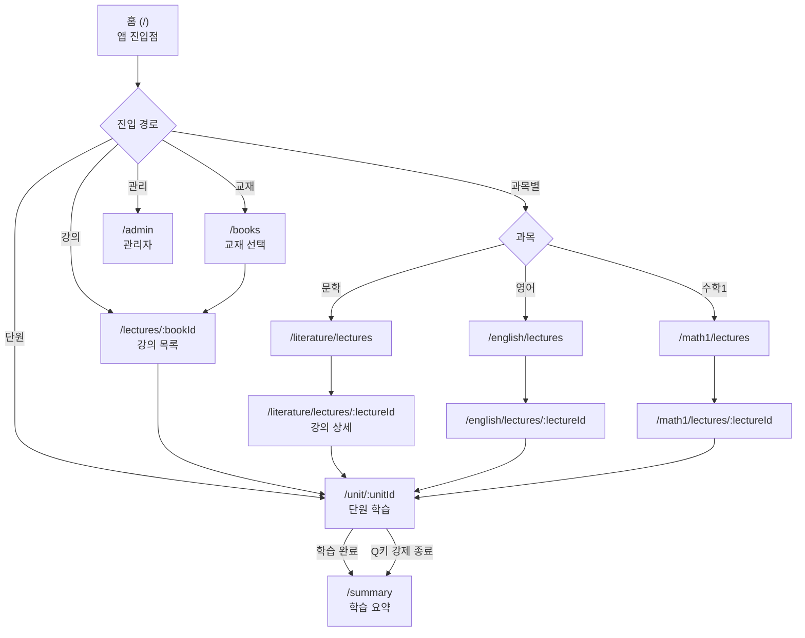
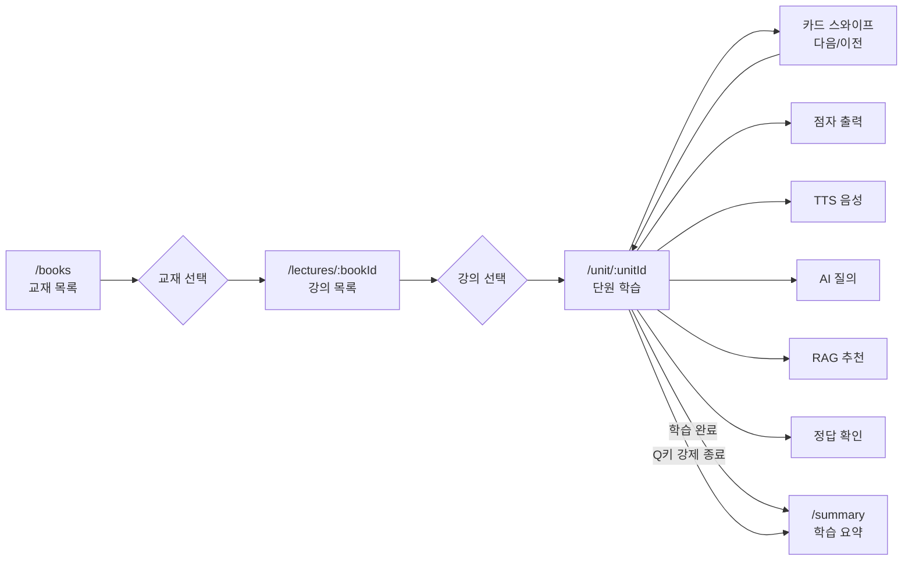
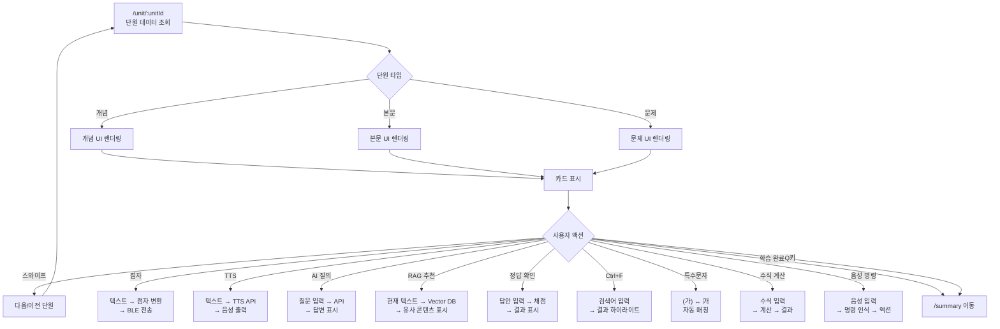
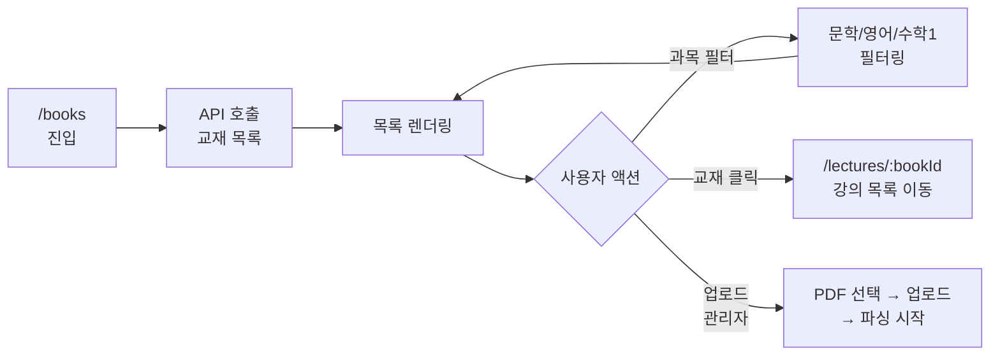
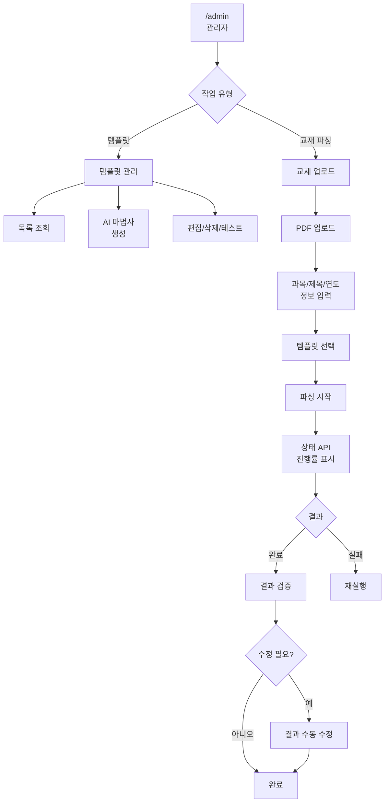
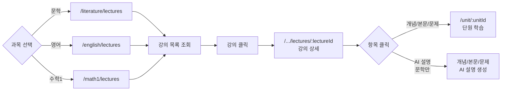
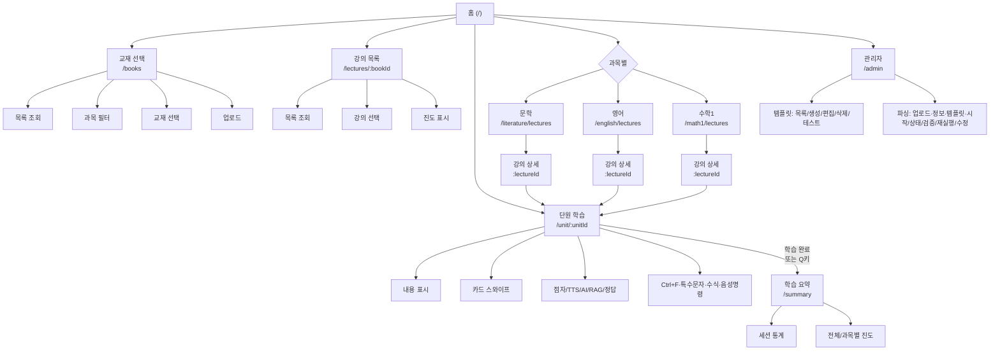

# 서비스 IA(Information Architecture)

> `SERVICE_IA.csv` 기반 서비스 정보 구조 문서

---

## 플로우차트 개요

### 전체 네비게이션 흐름



### 학습 사용자 플로우 (교재 → 강의 → 단원 → 요약)



### 단원 학습 화면 액션 플로우



### 교재 선택 (/books) 플로우



### 관리자 파싱 플로우



### 과목별 강의 진입 플로우



---

## 1. 홈 화면

| 항목 | 내용 |
|------|------|
| **경로** | `/` |
| **설명** | 앱 진입점 |
| **기능/액션** | 환영 메시지 표시 |
| **필수 여부** | 필수 |
| **비고** | 최상위 레벨 |

### 1.1 최근 강의 표시

| 항목 | 내용 |
|------|------|
| **경로** | `/` |
| **설명** | 이어서 학습하기 기능 |
| **기능/액션** | 최근 학습 단원 조회 → 표시 |
| **필수 여부** | 선택 |

### 1.2 교재 선택 버튼

| 항목 | 내용 |
|------|------|
| **경로** | `/` |
| **설명** | 교재 선택 화면으로 이동 |
| **기능/액션** | 교재 선택 버튼 클릭 → `/books` 이동 |
| **필수 여부** | 필수 |

### 1.3 과목별 바로가기

| 항목 | 내용 |
|------|------|
| **경로** | `/` |
| **설명** | 문학/영어/수학1 과목별 강의 목록으로 이동 |
| **기능/액션** | 과목 버튼 클릭 → 해당 과목 강의 목록 이동 |
| **필수 여부** | 선택 |

### 1.4 관리자 페이지 버튼

| 항목 | 내용 |
|------|------|
| **경로** | `/` |
| **설명** | 관리자 페이지로 이동 (관리자 권한) |
| **기능/액션** | 관리자 버튼 클릭 → `/admin` 이동 |
| **필수 여부** | 선택 |
| **비고** | 관리자 전용 |

---

## 2. 교재 선택

| 항목 | 내용 |
|------|------|
| **경로** | `/books` |
| **설명** | 사용 가능한 교재 목록 표시 및 선택 |

### 2.1 교재 목록 조회

| 항목 | 내용 |
|------|------|
| **경로** | `/books` |
| **설명** | 등록된 교재 목록 표시 |
| **기능/액션** | API 호출 → 교재 목록 렌더링 |
| **필수 여부** | 필수 |

### 2.2 과목별 필터링

| 항목 | 내용 |
|------|------|
| **경로** | `/books` |
| **설명** | 문학/영어/수학1 과목별 필터 |
| **기능/액션** | 필터 선택 → 목록 필터링 |
| **필수 여부** | 선택 |

### 2.3 교재 선택

| 항목 | 내용 |
|------|------|
| **경로** | `/books` |
| **설명** | 교재 선택 및 강의 목록으로 이동 |
| **기능/액션** | 교재 클릭 → 강의 목록 화면으로 이동 |
| **필수 여부** | 필수 |

### 2.4 교재 업로드

| 항목 | 내용 |
|------|------|
| **경로** | `/books` |
| **설명** | PDF 교재 업로드 (관리자 권한) |
| **기능/액션** | 파일 선택 → 업로드 → 파싱 시작 |
| **필수 여부** | 선택 |
| **비고** | 관리자 전용 |

---

## 3. 강의 목록

| 항목 | 내용 |
|------|------|
| **경로** | `/lectures/:bookId` |
| **설명** | 선택한 교재의 강의 목록 표시 |

### 3.1 강의 목록 조회

| 항목 | 내용 |
|------|------|
| **경로** | `/lectures/:bookId` |
| **설명** | 선택한 교재의 강의 목록 표시 |
| **기능/액션** | API 호출 → 강의 목록 렌더링 |
| **필수 여부** | 필수 |

### 3.2 강의 선택

| 항목 | 내용 |
|------|------|
| **경로** | `/lectures/:bookId` |
| **설명** | 강의 선택 및 단원 학습으로 이동 |
| **기능/액션** | 강의 클릭 → 첫 번째 단원으로 이동 |
| **필수 여부** | 필수 |

### 3.3 학습 진도 표시

| 항목 | 내용 |
|------|------|
| **경로** | `/lectures/:bookId` |
| **설명** | 각 강의의 학습 완료 여부 표시 |
| **기능/액션** | 진도 데이터 조회 → 시각적 표시 |
| **필수 여부** | 선택 |

---

## 4. 단원 학습

| 항목 | 내용 |
|------|------|
| **경로** | `/unit/:unitId` |
| **설명** | 카드 스와이프 기반 단원 학습 |

### 4.1 단원 내용 표시

| 항목 | 내용 |
|------|------|
| **경로** | `/unit/:unitId` |
| **설명** | 개념/본문/문제 내용 표시 |
| **기능/액션** | 단원 데이터 조회 → 카드 형태로 표시 |
| **필수 여부** | 필수 |

### 4.2 카드 스와이프

| 항목 | 내용 |
|------|------|
| **경로** | `/unit/:unitId` |
| **설명** | 다음/이전 단원으로 이동 |
| **기능/액션** | 스와이프 제스처 → 단원 변경 |
| **필수 여부** | 필수 |

### 4.3 점자 디스플레이 출력

| 항목 | 내용 |
|------|------|
| **경로** | `/unit/:unitId` |
| **설명** | 현재 단원 내용을 점자로 출력 |
| **기능/액션** | 텍스트 → 점자 변환 → BLE 전송 |
| **필수 여부** | 선택 |

### 4.4 음성 읽기 (TTS)

| 항목 | 내용 |
|------|------|
| **경로** | `/unit/:unitId` |
| **설명** | 현재 단원 내용을 음성으로 읽기 |
| **기능/액션** | 텍스트 → TTS API 호출 → 음성 출력 |
| **필수 여부** | 선택 |

### 4.5 AI 질의응답

| 항목 | 내용 |
|------|------|
| **경로** | `/unit/:unitId` |
| **설명** | AI에게 질문하고 답변 받기 |
| **기능/액션** | 질문 입력 → API 호출 → 답변 표시 |
| **필수 여부** | 선택 |

### 4.6 유사 콘텐츠 추천 (RAG)

| 항목 | 내용 |
|------|------|
| **경로** | `/unit/:unitId` |
| **설명** | RAG 기반 유사 개념/문제/본문 추천 |
| **기능/액션** | 현재 단원 텍스트 → Vector DB 검색 → 유사 콘텐츠 표시 |
| **필수 여부** | 선택 |

### 4.7 정답 입력 및 확인

| 항목 | 내용 |
|------|------|
| **경로** | `/unit/:unitId` |
| **설명** | 문제 정답 입력 및 채점 |
| **기능/액션** | 답안 입력 → 정답 확인 → 결과 표시 |
| **필수 여부** | 선택 |

### 4.8 단원 타입별 표시

| 항목 | 내용 |
|------|------|
| **경로** | `/unit/:unitId` |
| **설명** | 개념/본문/문제 타입에 따른 UI 표시 |
| **기능/액션** | 타입 확인 → 해당 UI 렌더링 |
| **필수 여부** | 필수 |

### 4.9 텍스트 찾기 (Ctrl+F)

| 항목 | 내용 |
|------|------|
| **경로** | `/unit/:unitId` |
| **설명** | 텍스트 검색 기능 (2026학년도 수능 대응) |
| **기능/액션** | Ctrl+F → 검색어 입력 → 결과 하이라이트 |
| **필수 여부** | 선택 |
| **비고** | 실제 수능 환경 반영 |

### 4.10 특수문자 변형 처리

| 항목 | 내용 |
|------|------|
| **경로** | `/unit/:unitId` |
| **설명** | 2026학년도 수능 특수문자 변형 자동 매칭 |
| **기능/액션** | 괄호 문자 변형 (가) ↔ ㈎ 자동 매칭 |
| **필수 여부** | 선택 |
| **비고** | 실제 수능 환경 반영 |

### 4.11 수식 계산기 (수학)

| 항목 | 내용 |
|------|------|
| **경로** | `/unit/:unitId` |
| **설명** | 수식 계산 도구 (한소네 대체) |
| **기능/액션** | 수식 입력 → 계산 → 결과 출력 |
| **필수 여부** | 선택 |
| **비고** | 수학 과목 전용 |

### 4.12 음성 명령 (STT)

| 항목 | 내용 |
|------|------|
| **경로** | `/unit/:unitId` |
| **설명** | 음성으로 명령 입력 |
| **기능/액션** | 음성 입력 → 명령 인식 → 액션 실행 |
| **필수 여부** | 선택 |

### 4.13 학습 완료 처리

| 항목 | 내용 |
|------|------|
| **경로** | `/unit/:unitId` |
| **설명** | 학습 완료 시 요약 화면으로 이동 |
| **기능/액션** | 학습 완료 → `/summary` 이동 |
| **필수 여부** | 필수 |

### 4.14 Q키 강제 종료

| 항목 | 내용 |
|------|------|
| **경로** | `/unit/:unitId` |
| **설명** | Q키로 학습 세션 강제 종료 |
| **기능/액션** | Q키 입력 → `/summary` 이동 |
| **필수 여부** | 선택 |

---

## 5. 학습 요약

| 항목 | 내용 |
|------|------|
| **경로** | `/summary` |
| **설명** | 학습 세션 완료 후 통계 및 요약 표시 |
| **접근 경로** | 단원 학습 완료 시 자동 이동 또는 학습 중 Q 키로 강제 종료 |
| **비고** | 홈에서 직접 접근 불가, 학습 세션 완료 후에만 접근 가능 |

### 5.1 세션 통계 표시

| 항목 | 내용 |
|------|------|
| **경로** | `/summary` |
| **설명** | 학습 문제 수, 정답률, 학습 시간 표시 |
| **기능/액션** | 세션 통계 조회 → 표시 |
| **필수 여부** | 필수 |

### 5.2 전체 진도 표시

| 항목 | 내용 |
|------|------|
| **경로** | `/summary` |
| **설명** | 전체 학습 진도 퍼센트 표시 |
| **기능/액션** | 진도 데이터 조회 → 진도 바 표시 |
| **필수 여부** | 필수 |

### 5.3 다음 강의로 이동

| 항목 | 내용 |
|------|------|
| **경로** | `/summary` |
| **설명** | 다음 강의로 계속 학습 |
| **기능/액션** | 다음 강의 조회 → 단원 학습으로 이동 |
| **필수 여부** | 필수 |

### 5.4 홈으로 이동

| 항목 | 내용 |
|------|------|
| **경로** | `/summary` |
| **설명** | 홈 화면으로 이동 |
| **기능/액션** | 홈 화면으로 이동 |
| **필수 여부** | 필수 |

---

## 6. 문학 강의 목록

| 항목 | 내용 |
|------|------|
| **경로** | `/literature/lectures` |
| **설명** | 문학 강의 목록 조회 |

### 6.1 강의 목록 조회

| 항목 | 내용 |
|------|------|
| **경로** | `/literature/lectures` |
| **설명** | 문학 강의 목록 표시 |
| **기능/액션** | API 호출 → 강의 목록 렌더링 |
| **필수 여부** | 필수 |

### 6.2 강의 선택

| 항목 | 내용 |
|------|------|
| **경로** | `/literature/lectures` |
| **설명** | 강의 선택 및 상세 화면으로 이동 |
| **기능/액션** | 강의 클릭 → 강의 상세 화면으로 이동 |
| **필수 여부** | 필수 |

---

## 7. 문학 강의 상세

| 항목 | 내용 |
|------|------|
| **경로** | `/literature/lectures/:lectureId` |
| **설명** | 문학 강의 상세 정보 및 학습 콘텐츠 |

### 7.1 강의 정보 표시

| 항목 | 내용 |
|------|------|
| **경로** | `/literature/lectures/:lectureId` |
| **설명** | 강의 제목/페이지 범위 등 정보 표시 |
| **기능/액션** | 강의 데이터 조회 → 정보 표시 |
| **필수 여부** | 필수 |

### 7.2 개념 목록 표시

| 항목 | 내용 |
|------|------|
| **경로** | `/literature/lectures/:lectureId` |
| **설명** | 강의 내 개념 목록 표시 |
| **기능/액션** | 개념 데이터 조회 → 목록 표시 |
| **필수 여부** | 필수 |

### 7.3 본문 목록 표시

| 항목 | 내용 |
|------|------|
| **경로** | `/literature/lectures/:lectureId` |
| **설명** | 강의 내 본문(작품) 목록 표시 |
| **기능/액션** | 본문 데이터 조회 → 목록 표시 |
| **필수 여부** | 필수 |

### 7.4 문제 목록 표시

| 항목 | 내용 |
|------|------|
| **경로** | `/literature/lectures/:lectureId` |
| **설명** | 강의 내 문제 목록 표시 |
| **기능/액션** | 문제 데이터 조회 → 목록 표시 |
| **필수 여부** | 필수 |

### 7.5 단원 학습으로 이동

| 항목 | 내용 |
|------|------|
| **경로** | `/literature/lectures/:lectureId` |
| **설명** | 개념/본문/문제 클릭 시 단원 학습으로 이동 |
| **기능/액션** | 항목 클릭 → 단원 학습 화면으로 이동 |
| **필수 여부** | 필수 |

### 7.6 AI 개념 설명 생성

| 항목 | 내용 |
|------|------|
| **경로** | `/literature/lectures/:lectureId` |
| **설명** | AI를 통한 개념 상세 설명 생성 |
| **기능/액션** | 개념 선택 → API 호출 → 설명 표시 |
| **필수 여부** | 선택 |

### 7.7 AI 본문 설명 생성

| 항목 | 내용 |
|------|------|
| **경로** | `/literature/lectures/:lectureId` |
| **설명** | AI를 통한 본문(작품) 상세 설명 생성 |
| **기능/액션** | 본문 선택 → API 호출 → 설명 표시 |
| **필수 여부** | 선택 |

### 7.8 AI 문제 설명 생성

| 항목 | 내용 |
|------|------|
| **경로** | `/literature/lectures/:lectureId` |
| **설명** | AI를 통한 문제 해설 생성 |
| **기능/액션** | 문제 선택 → API 호출 → 해설 표시 |
| **필수 여부** | 선택 |

---

## 8. 영어 강의 목록

| 항목 | 내용 |
|------|------|
| **경로** | `/english/lectures` |
| **설명** | 영어 강의 목록 조회 |

### 8.1 강의 목록 조회

| 항목 | 내용 |
|------|------|
| **경로** | `/english/lectures` |
| **설명** | 영어 강의 목록 표시 |
| **기능/액션** | API 호출 → 강의 목록 렌더링 |
| **필수 여부** | 필수 |

### 8.2 강의 선택

| 항목 | 내용 |
|------|------|
| **경로** | `/english/lectures` |
| **설명** | 강의 선택 및 상세 화면으로 이동 |
| **기능/액션** | 강의 클릭 → 강의 상세 화면으로 이동 |
| **필수 여부** | 필수 |

---

## 9. 영어 강의 상세

| 항목 | 내용 |
|------|------|
| **경로** | `/english/lectures/:lectureId` |
| **설명** | 영어 강의 상세 정보 및 학습 콘텐츠 |

### 9.1 강의 정보 표시

| 항목 | 내용 |
|------|------|
| **경로** | `/english/lectures/:lectureId` |
| **설명** | 강의 제목/페이지 범위 등 정보 표시 |
| **기능/액션** | 강의 데이터 조회 → 정보 표시 |
| **필수 여부** | 필수 |

### 9.2 개념 목록 표시

| 항목 | 내용 |
|------|------|
| **경로** | `/english/lectures/:lectureId` |
| **설명** | 강의 내 개념 목록 표시 |
| **기능/액션** | 개념 데이터 조회 → 목록 표시 |
| **필수 여부** | 필수 |

### 9.3 본문 목록 표시

| 항목 | 내용 |
|------|------|
| **경로** | `/english/lectures/:lectureId` |
| **설명** | 강의 내 본문 목록 표시 |
| **기능/액션** | 본문 데이터 조회 → 목록 표시 |
| **필수 여부** | 필수 |

### 9.4 문제 목록 표시

| 항목 | 내용 |
|------|------|
| **경로** | `/english/lectures/:lectureId` |
| **설명** | 강의 내 문제 목록 표시 |
| **기능/액션** | 문제 데이터 조회 → 목록 표시 |
| **필수 여부** | 필수 |

### 9.5 단원 학습으로 이동

| 항목 | 내용 |
|------|------|
| **경로** | `/english/lectures/:lectureId` |
| **설명** | 개념/본문/문제 클릭 시 단원 학습으로 이동 |
| **기능/액션** | 항목 클릭 → 단원 학습 화면으로 이동 |
| **필수 여부** | 필수 |

---

## 10. 수학1 강의 목록

| 항목 | 내용 |
|------|------|
| **경로** | `/math1/lectures` |
| **설명** | 수학1 강의 목록 조회 |

### 10.1 강의 목록 조회

| 항목 | 내용 |
|------|------|
| **경로** | `/math1/lectures` |
| **설명** | 수학1 강의 목록 표시 |
| **기능/액션** | API 호출 → 강의 목록 렌더링 |
| **필수 여부** | 필수 |

### 10.2 강의 선택

| 항목 | 내용 |
|------|------|
| **경로** | `/math1/lectures` |
| **설명** | 강의 선택 및 상세 화면으로 이동 |
| **기능/액션** | 강의 클릭 → 강의 상세 화면으로 이동 |
| **필수 여부** | 필수 |

---

## 11. 수학1 강의 상세

| 항목 | 내용 |
|------|------|
| **경로** | `/math1/lectures/:lectureId` |
| **설명** | 수학1 강의 상세 정보 및 학습 콘텐츠 |

### 11.1 강의 정보 표시

| 항목 | 내용 |
|------|------|
| **경로** | `/math1/lectures/:lectureId` |
| **설명** | 강의 제목/페이지 범위 등 정보 표시 |
| **기능/액션** | 강의 데이터 조회 → 정보 표시 |
| **필수 여부** | 필수 |

### 11.2 개념 목록 표시

| 항목 | 내용 |
|------|------|
| **경로** | `/math1/lectures/:lectureId` |
| **설명** | 강의 내 개념 목록 표시 |
| **기능/액션** | 개념 데이터 조회 → 목록 표시 |
| **필수 여부** | 필수 |

### 11.3 본문 목록 표시

| 항목 | 내용 |
|------|------|
| **경로** | `/math1/lectures/:lectureId` |
| **설명** | 강의 내 본문 목록 표시 |
| **기능/액션** | 본문 데이터 조회 → 목록 표시 |
| **필수 여부** | 필수 |

### 11.4 문제 목록 표시

| 항목 | 내용 |
|------|------|
| **경로** | `/math1/lectures/:lectureId` |
| **설명** | 강의 내 문제 목록 표시 |
| **기능/액션** | 문제 데이터 조회 → 목록 표시 |
| **필수 여부** | 필수 |

### 11.5 단원 학습으로 이동

| 항목 | 내용 |
|------|------|
| **경로** | `/math1/lectures/:lectureId` |
| **설명** | 개념/본문/문제 클릭 시 단원 학습으로 이동 |
| **기능/액션** | 항목 클릭 → 단원 학습 화면으로 이동 |
| **필수 여부** | 필수 |

---

## 12. 관리자 페이지

| 항목 | 내용 |
|------|------|
| **경로** | `/admin` |
| **설명** | 템플릿 관리 및 교재 업로드/파싱 관리 |
| **비고** | 관리자 전용 |

### 12.1 템플릿 관리

#### 12.1.1 템플릿 목록 조회

| 항목 | 내용 |
|------|------|
| **경로** | `/admin` |
| **설명** | 등록된 템플릿 목록 표시 |
| **기능/액션** | API 호출 → 템플릿 목록 렌더링 |
| **필수 여부** | 필수 |

#### 12.1.2 템플릿 생성 마법사

| 항목 | 내용 |
|------|------|
| **경로** | `/admin` |
| **설명** | AI 기반 템플릿 자동 생성 |
| **기능/액션** | 목차 텍스트 입력 → AI 분석 → 템플릿 생성 |
| **필수 여부** | 필수 |

#### 12.1.3 템플릿 편집

| 항목 | 내용 |
|------|------|
| **경로** | `/admin` |
| **설명** | 기존 템플릿 수정 |
| **기능/액션** | 템플릿 선택 → 편집 → 저장 |
| **필수 여부** | 선택 |

#### 12.1.4 템플릿 삭제

| 항목 | 내용 |
|------|------|
| **경로** | `/admin` |
| **설명** | 템플릿 삭제 |
| **기능/액션** | 템플릿 선택 → 삭제 확인 → 삭제 |
| **필수 여부** | 선택 |

#### 12.1.5 템플릿 테스트

| 항목 | 내용 |
|------|------|
| **경로** | `/admin` |
| **설명** | 템플릿 파싱 테스트 |
| **기능/액션** | 테스트 PDF 선택 → 파싱 실행 → 결과 확인 |
| **필수 여부** | 선택 |

### 12.2 교재 업로드 및 파싱

#### 12.2.1 PDF 파일 업로드

| 항목 | 내용 |
|------|------|
| **경로** | `/admin` |
| **설명** | PDF 교재 파일 업로드 |
| **기능/액션** | 파일 선택 → 업로드 → 서버 저장 |
| **필수 여부** | 필수 |

#### 12.2.2 교재 정보 입력

| 항목 | 내용 |
|------|------|
| **경로** | `/admin` |
| **설명** | 과목/제목/연도 등 정보 입력 |
| **기능/액션** | 폼 입력 → 데이터 검증 → 저장 |
| **필수 여부** | 필수 |

#### 12.2.3 템플릿 선택

| 항목 | 내용 |
|------|------|
| **경로** | `/admin` |
| **설명** | 파싱에 사용할 템플릿 선택 |
| **기능/액션** | 템플릿 목록 조회 → 템플릿 선택 |
| **필수 여부** | 필수 |

#### 12.2.4 파싱 시작

| 항목 | 내용 |
|------|------|
| **경로** | `/admin` |
| **설명** | 교재 파싱 프로세스 시작 |
| **기능/액션** | 파싱 요청 → 백그라운드 작업 시작 → 상태 업데이트 |
| **필수 여부** | 필수 |

#### 12.2.5 파싱 상태 확인

| 항목 | 내용 |
|------|------|
| **경로** | `/admin` |
| **설명** | 진행 중인 파싱 상태 조회 |
| **기능/액션** | 상태 API 호출 → 진행률 표시 |
| **필수 여부** | 필수 |

#### 12.2.6 파싱 결과 검증

| 항목 | 내용 |
|------|------|
| **경로** | `/admin` |
| **설명** | 파싱 완료된 결과 검증 |
| **기능/액션** | 결과 데이터 조회 → 검증 → 피드백 |
| **필수 여부** | 필수 |

#### 12.2.7 파싱 재실행

| 항목 | 내용 |
|------|------|
| **경로** | `/admin` |
| **설명** | 실패한 파싱 재실행 |
| **기능/액션** | 재실행 요청 → 파싱 프로세스 재시작 |
| **필수 여부** | 선택 |

#### 12.2.8 파싱 결과 수정

| 항목 | 내용 |
|------|------|
| **경로** | `/admin` |
| **설명** | 파싱 결과 수동 수정 |
| **기능/액션** | 결과 데이터 편집 → 저장 |
| **필수 여부** | 선택 |

---

## IA 구조 요약 (계층도)

### Mermaid 플로우차트



### 텍스트 계층도

```
홈 (/)
│   ├── 최근 강의 표시(이어서 학습) · 교재 선택 버튼 → /books · 과목별 바로가기 · 관리자 버튼 → /admin
├── 교재 선택 (/books)
│   ├── 교재 목록 조회 · 과목별 필터링 · 교재 선택 · 교재 업로드(관리자)
├── 강의 목록 (/lectures/:bookId)
│   ├── 강의 목록 조회 · 강의 선택 · 학습 진도 표시
├── 단원 학습 (/unit/:unitId)
│   ├── 단원 내용 표시 · 카드 스와이프 · 점자/TTS · AI 질의 · RAG 추천 · 정답 확인 · 타입별 UI
│   ├── 텍스트 찾기(Ctrl+F) · 특수문자 변형(가↔㈎) · 수식 계산기(수학) · 음성 명령(STT)
│   ├── 학습 완료 → /summary · Q키 강제 종료 → /summary
├── 학습 요약 (/summary) [학습 완료 후 접근]
│   ├── 세션 통계 · 전체/과목별 진도 · 학습 시간
├── 문학 강의 (/literature/lectures)
│   ├── 강의 목록 · 강의 선택
│   └── 강의 상세 (/literature/lectures/:lectureId)
│       ├── 개념/본문/문제 목록 · 단원 이동 · AI 설명(개념/본문/문제)
├── 영어 강의 (/english/lectures)
│   ├── 강의 목록 · 강의 선택
│   └── 강의 상세 (/english/lectures/:lectureId)
│       ├── 개념/본문/문제 목록 · 단원 이동
├── 수학1 강의 (/math1/lectures)
│   ├── 강의 목록 · 강의 선택
│   └── 강의 상세 (/math1/lectures/:lectureId)
│       ├── 개념/본문/문제 목록 · 단원 이동
└── 관리자 (/admin)
    ├── 템플릿: 목록/생성/편집/삭제/테스트
    └── 파싱: 업로드 · 정보 입력 · 템플릿 선택 · 파싱 시작/상태/검증/재실행/수정
```

---

*원본: `docs/SERVICE_IA.csv`*
