# 서비스 IA(Information Architecture) - 포트폴리오 버전

> 점그리 수능 도우미 서비스 정보 구조 및 사용자 플로우

**작성일**: 2026년 1월 28일  
**버전**: 2.0.0

---

## 1. 전체 네비게이션 흐름

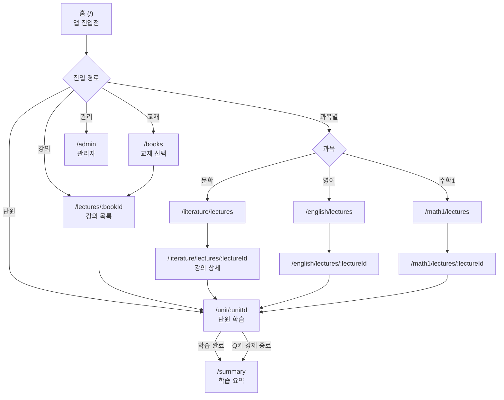

---

## 2. 학습 사용자 플로우

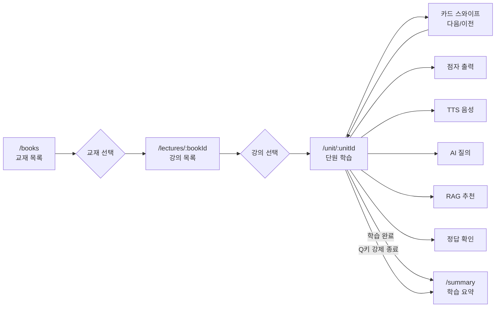

---

## 3. 단원 학습 화면 액션 플로우

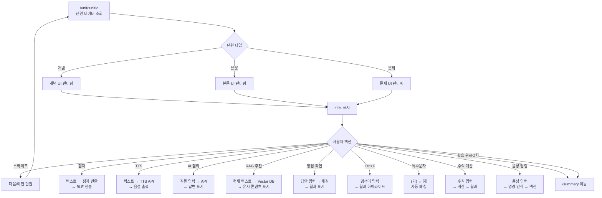

---

## 4. 주요 페이지별 기능 플로우

### 4.1 홈 화면 (/)

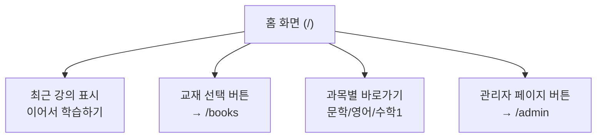

### 4.2 교재 선택 (/books)

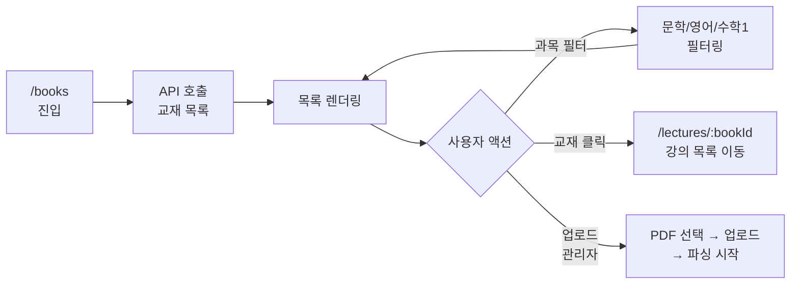

### 4.3 강의 목록 (/lectures/:bookId)

```mermaid
flowchart TD
    A["/lectures/:bookId"] --> B[API 호출<br/>강의 목록]
    B --> C[강의 목록 렌더링]
    C --> D[학습 진도 표시]
    C --> E{강의 선택}
    E --> F["/unit/:unitId<br/>첫 번째 단원으로 이동]
```

### 4.4 단원 학습 (/unit/:unitId)

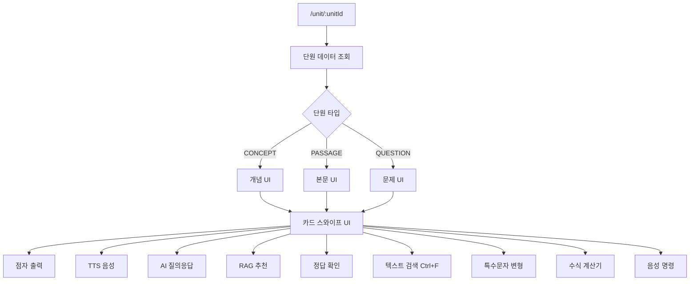

### 4.5 학습 요약 (/summary)

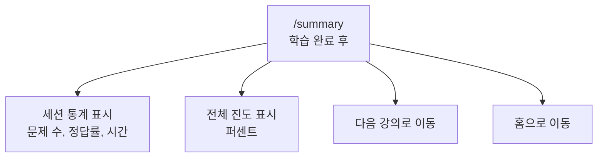

### 4.6 과목별 강의 진입 플로우

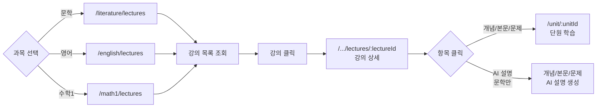

### 4.7 관리자 페이지 (/admin)

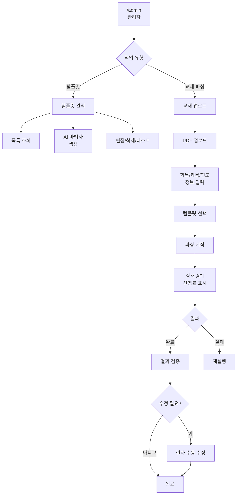

---

## 5. AI 서비스 플로우

### 5.1 AI 질의응답 플로우

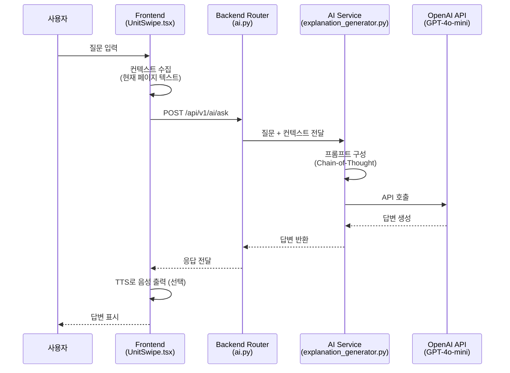

### 5.2 RAG 추천 플로우

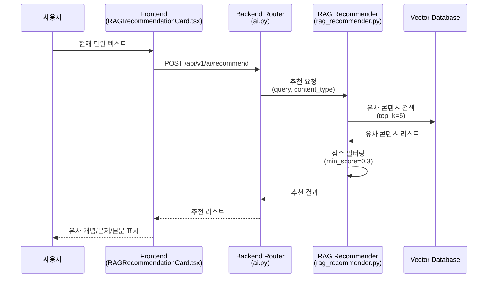

### 5.3 RAG 시스템 초기화 플로우

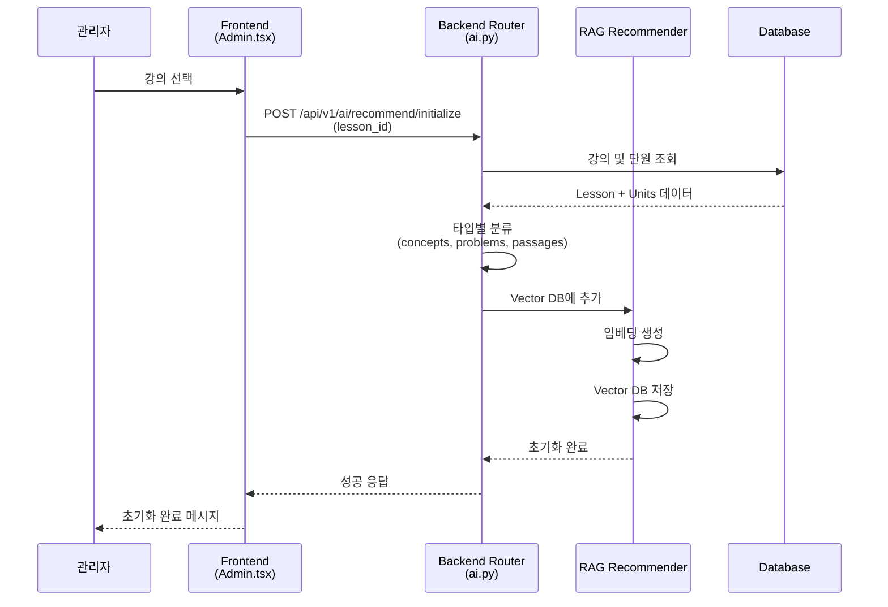

---

## 6. 점자 변환 및 출력 플로우

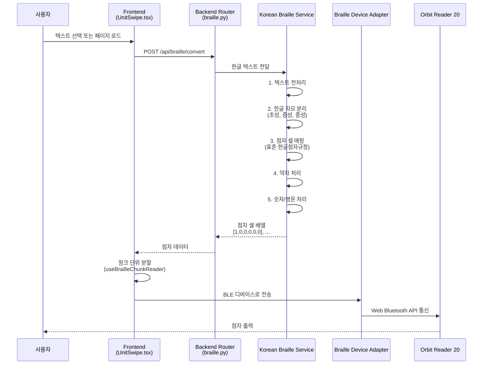

---

## 7. IA 구조 요약 (계층도)

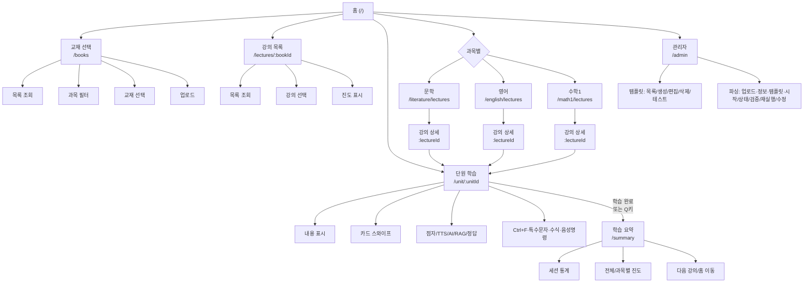

---

## 8. 주요 기능 매트릭스

| 페이지 | 경로 | 주요 기능 |
|--------|------|----------|
| 홈 | `/` | 최근 강의 표시, 교재 선택, 과목별 바로가기, 관리자 |
| 교재 선택 | `/books` | 교재 목록, 과목 필터, 교재 선택, 업로드 |
| 강의 목록 | `/lectures/:bookId` | 강의 목록, 강의 선택, 진도 표시 |
| 단원 학습 | `/unit/:unitId` | 카드 스와이프, 점자/TTS, AI 질의, RAG 추천, 정답 확인, 검색, 수식 계산 |
| 학습 요약 | `/summary` | 세션 통계, 진도 표시, 다음 강의 이동 |
| 문학 강의 | `/literature/lectures` | 강의 목록, 강의 상세, AI 설명 |
| 영어 강의 | `/english/lectures` | 강의 목록, 강의 상세 |
| 수학1 강의 | `/math1/lectures` | 강의 목록, 강의 상세 |
| 관리자 | `/admin` | 템플릿 관리, 교재 업로드/파싱 |

---

## 9. API 엔드포인트 요약

### 9.1 교재 관련
- `POST /api/v1/books/upload` - PDF 업로드
- `GET /api/v1/books` - 교재 목록
- `GET /api/v1/books/{book_id}` - 교재 상세
- `GET /api/v1/books/{book_id}/parse-status` - 파싱 상태

### 9.2 강의 관련
- `GET /api/v1/literature/lectures` - 문학 강의 목록
- `GET /api/v1/literature/lectures/{lecture_id}` - 문학 강의 상세
- `GET /api/v1/english/lectures` - 영어 강의 목록
- `GET /api/v1/math1/lectures` - 수학1 강의 목록

### 9.3 단원 관련
- `GET /api/v1/lessons/{lesson_id}/units` - 단원 목록
- `GET /api/v1/units/{unit_id}` - 단원 상세

### 9.4 AI 관련
- `POST /api/v1/ai/ask` - AI 질의응답
- `POST /api/v1/ai/recommend` - RAG 추천
- `POST /api/v1/ai/recommend/initialize` - RAG 시스템 초기화

### 9.5 점자 관련
- `POST /api/braille/convert` - 한글 → 점자 변환 (prefix: /api)

### 9.6 학습 진도 관련
- `POST /api/v1/progress` - 진도 기록
- `GET /api/v1/progress/continue` - 이어서 학습하기

### 9.7 관리자 관련
- `GET /api/v1/templates` - 템플릿 목록
- `POST /api/v1/templates/generate-from-toc` - AI 템플릿 생성
- `POST /api/v1/templates/{subject}/{name}/test` - 템플릿 테스트

---

**문서 작성 완료**
