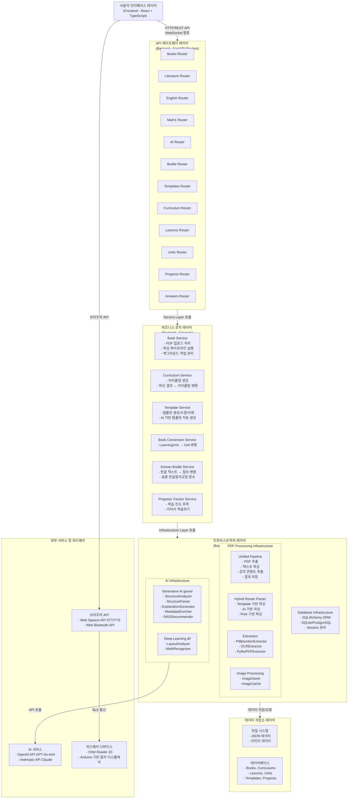

# 점그리 수능 도우미 - 시스템 아키텍처

**작성일**: 2026년 1월 27일  
**버전**: 2.0.0  
**프로젝트**: 점그리 수능 도우미 (Jeomgeuli Suneung Helper)

---

## 목차

1. [전체 시스템 아키텍처 개요](#1-전체-시스템-아키텍처-개요)
2. [프론트엔드 아키텍처](#2-프론트엔드-아키텍처)
3. [백엔드 아키텍처](#3-백엔드-아키텍처)
4. [데이터 흐름도](#4-데이터-흐름도)
5. [주요 컴포넌트 상세](#5-주요-컴포넌트-상세)

---

## 1. 전체 시스템 아키텍처 개요



---

## 2. 프론트엔드 아키텍처

```
┌─────────────────────────────────────────────────────────────────────────────┐
│                      프론트엔드 아키텍처 (React + TypeScript)                 │
└─────────────────────────────────────────────────────────────────────────────┘

┌─────────────────────────────────────────────────────────────────────────────┐
│  Presentation Layer (Pages)                                                  │
│  ┌──────────────┐  ┌──────────────┐  ┌──────────────┐  ┌──────────────┐    │
│  │    Start     │  │ BookSelect   │  │  Learning    │  │   Admin      │    │
│  │   (시작)     │  │ (교재 선택)  │  │  Summary     │  │  (관리자)    │    │
│  └──────────────┘  └──────────────┘  └──────────────┘  └──────────────┘    │
│  ┌──────────────┐  ┌──────────────┐  ┌──────────────┐  ┌──────────────┐    │
│  │ Literature   │  │   English    │  │    Math1     │  │  UnitSwipe   │    │
│  │  Lectures    │  │   Lectures   │  │   Lectures  │  │  (학습)      │    │
│  └──────────────┘  └──────────────┘  └──────────────┘  └──────────────┘    │
└─────────────────────────────────────────────────────────────────────────────┘
                                    │
                                    │ 사용
                                    │
┌──────────────────────────────────▼──────────────────────────────────────────┐
│  Component Layer                                                             │
│  ┌──────────────────────────────────────────────────────────────────────┐   │
│  │  재사용 가능한 컴포넌트                                               │   │
│  │  - braille/ (점자 관련)                                               │   │
│  │  - voice/ (음성 인터페이스)                                           │   │
│  │  - unit/ (학습 단위)                                                  │   │
│  │  - admin/ (관리자)                                                    │   │
│  │  - ai/ (AI 관련)                                                      │   │
│  └──────────────────────────────────────────────────────────────────────┘   │
└──────────────────────────────────┬──────────────────────────────────────────┘
                                    │
                                    │ 사용
                                    │
┌──────────────────────────────────▼──────────────────────────────────────────┐
│  Custom Hooks Layer                                                          │
│  ┌──────────────────────────────────────────────────────────────────────┐   │
│  │  useBrailleBLE.ts          - 점자 디스플레이 BLE 연동                 │   │
│  │  useAILearningAssistant.ts - AI 학습 도우미                          │   │
│  │  useTTS.ts                 - 음성 합성                                │   │
│  │  useSTT.ts                 - 음성 인식                               │   │
│  │  useUnitData.ts             - 단원 데이터 관리                         │   │
│  │  useUnitNavigation.ts      - 단원 네비게이션                          │   │
│  │  useVoiceCommands.ts       - 음성 명령 처리                           │   │
│  └──────────────────────────────────────────────────────────────────────┘   │
└──────────────────────────────────┬──────────────────────────────────────────┘
                                    │
                                    │ 사용
                                    │
┌──────────────────────────────────▼──────────────────────────────────────────┐
│  Service Layer                                                                │
│  ┌──────────────────────────────────────────────────────────────────────┐   │
│  │  API Client (api/client.ts)                                           │   │
│  │  - HTTP 요청/응답 처리                                                │   │
│  │  - 에러 핸들링                                                        │   │
│  └──────────────────────────────────────────────────────────────────────┘   │
│  ┌──────────────────────────────────────────────────────────────────────┐   │
│  │  Subject Services                                                     │   │
│  │  - literature.ts (문학 데이터)                                       │   │
│  │  - english.ts (영어 데이터)                                           │   │
│  │  - math1.ts (수학1 데이터)                                            │   │
│  └──────────────────────────────────────────────────────────────────────┘   │
│  ┌──────────────────────────────────────────────────────────────────────┐   │
│  │  AI Service (ai/index.ts)                                            │   │
│  │  - 질의응답                                                           │   │
│  │  - 설명 생성                                                          │   │
│  └──────────────────────────────────────────────────────────────────────┘   │
│  ┌──────────────────────────────────────────────────────────────────────┐   │
│  │  Voice Service (voice/index.ts)                                      │   │
│  │  - WebSpeechSTTProvider                                              │   │
│  │  - WebSpeechTTSProvider                                               │   │
│  └──────────────────────────────────────────────────────────────────────┘   │
└──────────────────────────────────┬──────────────────────────────────────────┘
                                    │
                                    │ 사용
                                    │
┌──────────────────────────────────▼──────────────────────────────────────────┐
│  State Management Layer (Zustand)                                            │
│  ┌──────────────────────────────────────────────────────────────────────┐   │
│  │  bookStore.ts          - 교재 및 강의 목록                            │   │
│  │  progressStore.ts      - 학습 진도                                    │   │
│  │  lessonStore.ts        - 현재 학습 중인 강의                          │   │
│  │  literatureProgressStore.ts - 문학 진도                               │   │
│  │  voice.ts              - 음성 인터페이스 상태                          │   │
│  └──────────────────────────────────────────────────────────────────────┘   │
└──────────────────────────────────┬──────────────────────────────────────────┘
                                    │
                                    │ 사용
                                    │
┌──────────────────────────────────▼──────────────────────────────────────────┐
│  Utility Layer                                                                │
│  ┌──────────────────────────────────────────────────────────────────────┐   │
│  │  Braille Utils                                                        │   │
│  │  - BrailleDeviceAdapter (점자 디바이스 어댑터)                        │   │
│  │  - OrbitReaderAdapter (Orbit Reader 20 지원)                          │   │
│  │  - GenericBLEAdapter (일반 BLE 디바이스)                              │   │
│  └──────────────────────────────────────────────────────────────────────┘   │
│  ┌──────────────────────────────────────────────────────────────────────┐   │
│  │  Text Utils                                                           │   │
│  │  - markdownToPlainText.ts                                            │   │
│  │  - sectionMatcher.ts                                                 │   │
│  │  - metadata.ts                                                       │   │
│  └──────────────────────────────────────────────────────────────────────┘   │
│  ┌──────────────────────────────────────────────────────────────────────┐   │
│  │  Voice Utils                                                          │   │
│  │  - commands.ts (음성 명령 정의)                                       │   │
│  │  - matchers.ts (명령 매칭)                                            │   │
│  │  - normalizers.ts (텍스트 정규화)                                    │   │
│  └──────────────────────────────────────────────────────────────────────┘   │
└──────────────────────────────────────────────────────────────────────────────┘
```

---

## 3. 백엔드 아키텍처

```
┌─────────────────────────────────────────────────────────────────────────────┐
│                      백엔드 아키텍처 (FastAPI)                                │
└─────────────────────────────────────────────────────────────────────────────┘

┌─────────────────────────────────────────────────────────────────────────────┐
│  Router Layer (API Endpoints)                                                │
│  ┌──────────────────────────────────────────────────────────────────────┐    │
│  │  Subject Routers                                                     │    │
│  │  - books.py       : 교재 관리 (업로드, 목록, 상태)                   │    │
│  │  - literature.py  : 문학 교재 데이터 API                             │    │
│  │  - english.py     : 영어 교재 데이터 API                             │    │
│  │  - math1.py       : 수학1 교재 데이터 API                             │    │
│  └──────────────────────────────────────────────────────────────────────┘    │
│  ┌──────────────────────────────────────────────────────────────────────┐    │
│  │  Learning Routers                                                     │    │
│  │  - lessons.py     : 강의 관리                                        │    │
│  │  - units.py       : 단원 관리                                        │    │
│  │  - curriculum.py  : 커리큘럼 관리                                    │    │
│  │  - progress.py    : 학습 진도 추적                                   │    │
│  │  - answers.py     : 답안 관리                                        │    │
│  └──────────────────────────────────────────────────────────────────────┘    │
│  ┌──────────────────────────────────────────────────────────────────────┐    │
│  │  Feature Routers                                                      │    │
│  │  - ai.py          : AI 질의응답                                      │    │
│  │  - braille.py     : 점자 변환                                        │    │
│  │  - templates.py   : 템플릿 관리                                      │    │
│  │  - health.py      : 헬스 체크                                        │    │
│  │  - subjects.py    : 과목 목록                                        │    │
│  └──────────────────────────────────────────────────────────────────────┘    │
└──────────────────────────────────┬──────────────────────────────────────────┘
                                    │
                                    │ 호출
                                    │
┌──────────────────────────────────▼──────────────────────────────────────────┐
│  Service Layer (Business Logic)                                               │
│  ┌──────────────────────────────────────────────────────────────────────┐   │
│  │  Book Service                                                          │   │
│  │  - upload_book()          : PDF 업로드 및 파싱 시작                    │   │
│  │  - get_books()            : 교재 목록 조회                            │   │
│  │  - get_book_status()      : 파싱 상태 조회                            │   │
│  │  - reparse_book()         : 재파싱                                    │   │
│  └──────────────────────────────────────────────────────────────────────┘   │
│  ┌──────────────────────────────────────────────────────────────────────┐   │
│  │  Curriculum Service                                                   │   │
│  │  - generate_curriculum()  : 커리큘럼 생성                             │   │
│  │  - get_curriculum()       : 커리큘럼 조회                             │   │
│  │  - update_curriculum()    : 커리큘럼 수정                            │   │
│  └──────────────────────────────────────────────────────────────────────┘   │
│  ┌──────────────────────────────────────────────────────────────────────┐   │
│  │  Template Service                                                     │   │
│  │  - generate_template()    : AI 기반 템플릿 생성                      │   │
│  │  - get_templates()        : 템플릿 목록 조회                         │   │
│  │  - update_template()      : 템플릿 수정                              │   │
│  │  - delete_template()      : 템플릿 삭제                              │   │
│  └──────────────────────────────────────────────────────────────────────┘   │
│  ┌──────────────────────────────────────────────────────────────────────┐   │
│  │  Book Conversion Service                                              │   │
│  │  - convert_learning_units_to_units() : LearningUnit → Unit 변환       │   │
│  └──────────────────────────────────────────────────────────────────────┘   │
│  ┌──────────────────────────────────────────────────────────────────────┐   │
│  │  Korean Braille Service                                               │   │
│  │  - convert_to_braille()   : 한글 텍스트 → 점자 변환                  │   │
│  └──────────────────────────────────────────────────────────────────────┘   │
│  ┌──────────────────────────────────────────────────────────────────────┐   │
│  │  Progress Tracker Service                                             │   │
│  │  - track_progress()       : 진도 기록                                 │   │
│  │  - get_continue_learning() : 이어서 학습하기                         │   │
│  └──────────────────────────────────────────────────────────────────────┘   │
└──────────────────────────────────┬──────────────────────────────────────────┘
                                    │
                                    │ 호출
                                    │
┌──────────────────────────────────▼──────────────────────────────────────────┐
│  Infrastructure Layer                                                         │
│                                                                               │
│  ┌─────────────────────────────────────────────────────────────────────┐    │
│  │  PDF Processing                                                       │    │
│  │  ┌──────────────────────────────────────────────────────────────┐   │    │
│  │  │  Unified Pipeline                                             │   │    │
│  │  │  1. PDF 추출 (Extractors)                                     │   │    │
│  │  │     - PdfplumberExtractor (텍스트 추출)                       │   │    │
│  │  │     - OCRExtractor (OCR 기반 추출)                            │   │    │
│  │  │     - PyMuPDFExtractor (이미지 추출)                           │   │    │
│  │  │  2. 파싱 (Parsers)                                            │   │    │
│  │  │     - HybridRouter (템플릿/AI/Rule 기반)                      │   │    │
│  │  │     - LiteratureParser (문학 전용)                             │   │    │
│  │  │     - EnglishParser (영어 전용)                                │   │    │
│  │  │     - Math1Parser (수학1 전용)                                 │   │    │
│  │  │  3. 강의 콘텐츠 추출                                           │   │    │
│  │  │     - LectureContentsExtractor                                 │   │    │
│  │  │  4. 결과 저장                                                  │   │    │
│  │  │     - ResultSaver (JSON 저장)                                  │   │    │
│  │  │     - ImageSaver (이미지 크롭 및 저장)                         │   │    │
│  │  └──────────────────────────────────────────────────────────────┘   │    │
│  │  ┌──────────────────────────────────────────────────────────────┐   │    │
│  │  │  Template Manager                                             │   │    │
│  │  │  - 템플릿 로드 및 매칭                                         │   │    │
│  │  │  - 파싱 규칙 적용                                             │   │    │
│  │  └──────────────────────────────────────────────────────────────┘   │    │
│  └─────────────────────────────────────────────────────────────────────┘    │
│                                                                               │
│  ┌─────────────────────────────────────────────────────────────────────┐    │
│  │  AI Infrastructure                                                   │    │
│  │  ┌──────────────────────────────────────────────────────────────┐   │    │
│  │  │  Generative AI (genai/)                                       │   │    │
│  │  │  - StructureAnalyzer: PDF 구조 분석                            │   │    │
│  │  │  - StructureParser: 목차 파싱 및 강의 추출                    │   │    │
│  │  │  - ExplanationGenerator: 개념/본문/문제 설명 생성              │   │    │
│  │  │  - MetadataEnricher: 메타데이터 보강                          │   │    │
│  │  │  - RAGRecommender: RAG 기반 학습 추천                         │   │    │
│  │  └──────────────────────────────────────────────────────────────┘   │    │
│  │  ┌──────────────────────────────────────────────────────────────┐   │    │
│  │  │  Deep Learning (dl/)                                          │   │    │
│  │  │  - LayoutAnalyzer: 레이아웃 분석 (선택적)                    │   │    │
│  │  │  - MathRecognizer: 수식 인식 (선택적)                          │   │    │
│  │  └──────────────────────────────────────────────────────────────┘   │    │
│  └─────────────────────────────────────────────────────────────────────┘    │
│                                                                               │
│  ┌─────────────────────────────────────────────────────────────────────┐    │
│  │  Database Infrastructure                                              │    │
│  │  - SQLAlchemy ORM                                                     │    │
│  │  - Session 관리                                                       │    │
│  │  - 모델: Book, Curriculum, Lesson, Unit, Template, Progress            │    │
│  └─────────────────────────────────────────────────────────────────────┘    │
└──────────────────────────────────────────────────────────────────────────────┘
```

---

## 4. 데이터 흐름도

### 4.1 PDF 업로드 및 파싱 흐름

```
┌──────────┐
│  사용자  │
└────┬─────┘
     │
     │ 1. PDF 업로드 요청
     │    POST /api/v1/books/upload
     │
┌────▼──────────────────────────────────────────────────────────────────┐
│  Frontend (BookSelect.tsx)                                             │
│  - 파일 선택                                                           │
│  - FormData 생성                                                       │
└────┬──────────────────────────────────────────────────────────────────┘
     │
     │ 2. HTTP 요청
     │
┌────▼──────────────────────────────────────────────────────────────────┐
│  Backend Router (books.py)                                              │
│  @router.post("/books/upload")                                          │
└────┬──────────────────────────────────────────────────────────────────┘
     │
     │ 3. Service 호출
     │
┌────▼──────────────────────────────────────────────────────────────────┐
│  Book Service (book_service.py)                                        │
│  - upload_book()                                                       │
│  - 파일 저장                                                           │
│  - 파싱 파이프라인 시작 (백그라운드)                                    │
└────┬──────────────────────────────────────────────────────────────────┘
     │
     │ 4. Pipeline 실행
     │
┌────▼──────────────────────────────────────────────────────────────────┐
│  Unified Pipeline (pipeline.py)                                         │
│  ┌────────────────────────────────────────────────────────────────┐   │
│  │  1. PDF 추출                                                    │   │
│  │     - PdfplumberExtractor 또는 OCRExtractor                    │   │
│  │     - 텍스트 및 이미지 추출                                     │   │
│  └────────────────────────────────────────────────────────────────┘   │
│  ┌────────────────────────────────────────────────────────────────┐   │
│  │  2. 템플릿 매칭                                                 │   │
│  │     - TemplateManager                                          │   │
│  │     - 과목별 템플릿 자동 선택                                   │   │
│  └────────────────────────────────────────────────────────────────┘   │
│  ┌────────────────────────────────────────────────────────────────┐   │
│  │  3. 파싱                                                        │   │
│  │     - HybridRouter (템플릿/AI/Rule 기반)                       │   │
│  │     - 개념/본문/문제 분류                                       │   │
│  └────────────────────────────────────────────────────────────────┘   │
│  ┌────────────────────────────────────────────────────────────────┐   │
│  │  4. 강의 콘텐츠 추출                                           │   │
│  │     - LectureContentsExtractor                                 │   │
│  │     - 강의별 단원 그룹핑                                       │   │
│  └────────────────────────────────────────────────────────────────┘   │
│  ┌────────────────────────────────────────────────────────────────┐   │
│  │  5. 결과 저장                                                  │   │
│  │     - ResultSaver: JSON 파일 저장                              │   │
│  │     - ImageSaver: 이미지 크롭 및 저장                          │   │
│  │     - Database: Book 상태 업데이트                              │   │
│  └────────────────────────────────────────────────────────────────┘   │
└────┬──────────────────────────────────────────────────────────────────┘
     │
     │ 5. 저장 완료
     │
┌────▼──────────────────────────────────────────────────────────────────┐
│  파일 시스템                                                            │
│  - backend/data/{subject}/{book_id}/lectures/lecture_*.json          │
│  - backend/data/{subject}/{book_id}/*_images/*.png                   │
└───────────────────────────────────────────────────────────────────────┘
```

### 4.2 학습 데이터 조회 흐름

```
┌──────────┐
│  사용자  │
└────┬─────┘
     │
     │ 1. 강의 목록 조회 요청
     │    GET /api/v1/literature/lectures
     │
┌────▼──────────────────────────────────────────────────────────────────┐
│  Frontend (LiteratureLectures.tsx)                                    │
│  - API 호출                                                           │
└────┬──────────────────────────────────────────────────────────────────┘
     │
     │ 2. HTTP 요청
     │
┌────▼──────────────────────────────────────────────────────────────────┐
│  Backend Router (literature.py)                                       │
│  @router.get("/literature/lectures")                                  │
└────┬──────────────────────────────────────────────────────────────────┘
     │
     │ 3. 파일 시스템 조회
     │
┌────▼──────────────────────────────────────────────────────────────────┐
│  Data File Handler (data_file_handler.py)                             │
│  - backend/data/literature/{book_id}/lectures/lectures.json 읽기      │
└────┬──────────────────────────────────────────────────────────────────┘
     │
     │ 4. JSON 파싱 및 응답
     │
┌────▼──────────────────────────────────────────────────────────────────┐
│  Frontend                                                              │
│  - 데이터 표시                                                         │
│  - 상태 관리 (bookStore)                                               │
└───────────────────────────────────────────────────────────────────────┘
```

### 4.3 AI 질의응답 흐름

```
┌──────────┐
│  사용자  │
└────┬─────┘
     │
     │ 1. 질문 입력
     │    "이 개념을 설명해주세요"
     │
┌────▼──────────────────────────────────────────────────────────────────┐
│  Frontend (AIQuestionInput.tsx)                                       │
│  - 질문 입력                                                          │
│  - 컨텍스트 수집 (현재 페이지 텍스트)                                 │
└────┬──────────────────────────────────────────────────────────────────┘
     │
     │ 2. API 요청
     │    POST /api/v1/ai/ask
     │
┌────▼──────────────────────────────────────────────────────────────────┐
│  Backend Router (ai.py)                                               │
│  @router.post("/ai/ask")                                              │
└────┬──────────────────────────────────────────────────────────────────┘
     │
     │ 3. AI Service 호출
     │
┌────▼──────────────────────────────────────────────────────────────────┐
│  AI Infrastructure (genai/explanation_generator.py)                   │
│  - 프롬프트 구성                                                       │
│  - OpenAI API 호출                                                    │
│  - 응답 생성                                                          │
└────┬──────────────────────────────────────────────────────────────────┘
     │
     │ 4. 외부 API 호출
     │
┌────▼──────────────────────────────────────────────────────────────────┐
│  OpenAI API (GPT-4o-mini)                                             │
│  - 질문 및 컨텍스트 처리                                              │
│  - 답변 생성                                                          │
└────┬──────────────────────────────────────────────────────────────────┘
     │
     │ 5. 응답 반환
     │
┌────▼──────────────────────────────────────────────────────────────────┐
│  Frontend                                                              │
│  - 답변 표시                                                           │
│  - TTS로 음성 출력 (선택)                                              │
└───────────────────────────────────────────────────────────────────────┘
```

### 4.4 점자 변환 및 디스플레이 출력 흐름

```
┌──────────┐
│  사용자  │
└────┬─────┘
     │
     │ 1. 텍스트 선택 또는 페이지 로드
     │
┌────▼──────────────────────────────────────────────────────────────────┐
│  Frontend (UnitSwipe.tsx)                                             │
│  - 단원 텍스트 로드                                                    │
└────┬──────────────────────────────────────────────────────────────────┘
     │
     │ 2. 점자 변환 요청
     │    POST /api/braille/convert
     │
┌────▼──────────────────────────────────────────────────────────────────┐
│  Backend Router (braille.py)                                          │
│  @router.post("/braille/convert")                                    │
└────┬──────────────────────────────────────────────────────────────────┘
     │
     │ 3. 점자 변환 서비스 호출
     │
┌────▼──────────────────────────────────────────────────────────────────┐
│  Korean Braille Service (korean_braille.py)                          │
│  - 한글 텍스트 → 점자 셀 배열 변환                                     │
│  - 표준 한글점자규정 적용                                              │
└────┬──────────────────────────────────────────────────────────────────┘
     │
     │ 4. 점자 데이터 반환
     │    { cells: [[1,0,0,0,0,0], ...] }
     │
┌────▼──────────────────────────────────────────────────────────────────┐
│  Frontend (useBrailleBLE.ts)                                          │
│  - 점자 데이터 수신                                                    │
│  - BLE 디바이스 연결 확인                                              │
└────┬──────────────────────────────────────────────────────────────────┘
     │
     │ 5. BLE 디바이스로 전송
     │
┌────▼──────────────────────────────────────────────────────────────────┐
│  Braille Device Adapter                                               │
│  - OrbitReaderAdapter 또는 GenericBLEAdapter                          │
│  - Web Bluetooth API 사용                                             │
└────┬──────────────────────────────────────────────────────────────────┘
     │
     │ 6. BLE 통신
     │
┌────▼──────────────────────────────────────────────────────────────────┐
│  하드웨어 디바이스                                                     │
│  - Orbit Reader 20                                                    │
│  - 점자 출력                                                           │
└───────────────────────────────────────────────────────────────────────┘
```

---

## 5. 주요 컴포넌트 상세

### 5.1 PDF 파싱 파이프라인

```
┌─────────────────────────────────────────────────────────────────────────────┐
│                    PDF 파싱 파이프라인 상세                                  │
└─────────────────────────────────────────────────────────────────────────────┘

PDF 파일
    │
    ▼
┌─────────────────────────────────────────────────────────────────────────┐
│  Extractor 선택                                                          │
│  ┌──────────────────┐  ┌──────────────────┐  ┌──────────────────┐     │
│  │ Pdfplumber       │  │      OCR         │  │    PyMuPDF        │     │
│  │ Extractor        │  │   Extractor      │  │   Extractor      │     │
│  │                  │  │                  │  │                  │     │
│  │ - 텍스트 추출    │  │ - 이미지 OCR     │  │ - 이미지 추출    │     │
│  │ - 좌표 정보      │  │ - 레이아웃 분석  │  │ - PDF 렌더링     │     │
│  └──────────────────┘  └──────────────────┘  └──────────────────┘     │
└─────────────────────────────────────────────────────────────────────────┘
    │
    ▼
┌─────────────────────────────────────────────────────────────────────────┐
│  텍스트 및 이미지 데이터                                                 │
│  - 페이지별 텍스트 블록                                                  │
│  - 이미지 좌표 및 데이터                                                 │
└─────────────────────────────────────────────────────────────────────────┘
    │
    ▼
┌─────────────────────────────────────────────────────────────────────────┐
│  Template Manager                                                       │
│  - 과목별 템플릿 자동 매칭                                               │
│  - 파싱 규칙 로드                                                       │
└─────────────────────────────────────────────────────────────────────────┘
    │
    ▼
┌─────────────────────────────────────────────────────────────────────────┐
│  Hybrid Router (Parser)                                                 │
│  ┌──────────────────────────────────────────────────────────────────┐   │
│  │  Template 기반 파싱                                              │   │
│  │  - 정규식 패턴 매칭                                               │   │
│  │  - 구조 규칙 적용                                                 │   │
│  └──────────────────────────────────────────────────────────────────┘   │
│  ┌──────────────────────────────────────────────────────────────────┐   │
│  │  AI 기반 파싱                                                     │   │
│  │  - StructureAnalyzer (구조 분석)                                 │   │
│  │  - StructureParser (목차 파싱)                                  │   │
│  └──────────────────────────────────────────────────────────────────┘   │
│  ┌──────────────────────────────────────────────────────────────────┐   │
│  │  Rule 기반 파싱                                                   │   │
│  │  - 폰트 크기 분석                                                 │   │
│  │  - 레이아웃 분석                                                  │   │
│  └──────────────────────────────────────────────────────────────────┘   │
└─────────────────────────────────────────────────────────────────────────┘
    │
    ▼
┌─────────────────────────────────────────────────────────────────────────┐
│  분류된 단원 (LearningUnit)                                              │
│  - concept (개념)                                                        │
│  - passage (본문)                                                        │
│  - problem (문제)                                                        │
└─────────────────────────────────────────────────────────────────────────┘
    │
    ▼
┌─────────────────────────────────────────────────────────────────────────┐
│  Lecture Contents Extractor                                             │
│  - 강의별 단원 그룹핑                                                   │
│  - 페이지 범위 계산                                                     │
└─────────────────────────────────────────────────────────────────────────┘
    │
    ▼
┌─────────────────────────────────────────────────────────────────────────┐
│  결과 저장                                                               │
│  ┌──────────────────────────────────────────────────────────────────┐   │
│  │  ResultSaver                                                      │   │
│  │  - lectures.json (강의 목록)                                     │   │
│  │  - lecture_*.json (강의별 상세)                                  │   │
│  └──────────────────────────────────────────────────────────────────┘   │
│  ┌──────────────────────────────────────────────────────────────────┐   │
│  │  ImageSaver                                                       │   │
│  │  - concepts_images/*.png                                         │   │
│  │  - content_images/*.png                                          │   │
│  │  - problems_images/*.png                                          │   │
│  └──────────────────────────────────────────────────────────────────┘   │
└─────────────────────────────────────────────────────────────────────────┘
```

### 5.2 AI 통합 구조

```
┌─────────────────────────────────────────────────────────────────────────────┐
│                        AI 통합 구조 상세                                     │
└─────────────────────────────────────────────────────────────────────────────┘

┌─────────────────────────────────────────────────────────────────────────┐
│  AI Infrastructure (infrastructure/ai/)                                   │
│                                                                           │
│  ┌───────────────────────────────────────────────────────────────────┐   │
│  │  Generative AI (genai/)                                           │   │
│  │  ┌─────────────────────────────────────────────────────────────┐ │   │
│  │  │  StructureAnalyzer                                           │ │   │
│  │  │  - PDF 구조 분석                                             │ │   │
│  │  │  - 섹션 식별                                                 │ │   │
│  │  │  - 레이아웃 이해                                             │ │   │
│  │  └─────────────────────────────────────────────────────────────┘ │   │
│  │  ┌─────────────────────────────────────────────────────────────┐ │   │
│  │  │  StructureParser                                            │ │   │
│  │  │  - 목차 텍스트 파싱                                         │ │   │
│  │  │  - 강의 정보 추출                                           │ │   │
│  │  │  - 페이지 번호 매칭                                         │ │   │
│  │  └─────────────────────────────────────────────────────────────┘ │   │
│  │  ┌─────────────────────────────────────────────────────────────┐ │   │
│  │  │  ExplanationGenerator                                        │ │   │
│  │  │  - 개념 설명 생성                                            │ │   │
│  │  │  - 본문 해석 생성                                            │ │   │
│  │  │  - 문제 해설 생성                                            │ │   │
│  │  └─────────────────────────────────────────────────────────────┘ │   │
│  │  ┌─────────────────────────────────────────────────────────────┐ │   │
│  │  │  MetadataEnricher                                           │ │   │
│  │  │  - 메타데이터 보강                                          │ │   │
│  │  │  - 키워드 추출                                              │ │   │
│  │  │  - 난이도 추정                                              │ │   │
│  │  └─────────────────────────────────────────────────────────────┘ │   │
│  │  ┌─────────────────────────────────────────────────────────────┐ │   │
│  │  │  RAGRecommender                                             │ │   │
│  │  │  - RAG 기반 학습 추천                                       │ │   │
│  │  │  - 유사 콘텐츠 추천                                         │ │   │
│  │  └─────────────────────────────────────────────────────────────┘ │   │
│  └───────────────────────────────────────────────────────────────────┘   │
│                                                                           │
│  ┌───────────────────────────────────────────────────────────────────┐   │
│  │  Deep Learning (dl/)                                              │   │
│  │  ┌─────────────────────────────────────────────────────────────┐ │   │
│  │  │  LayoutAnalyzer                                             │ │   │
│  │  │  - 레이아웃 분석 (선택적)                                    │ │   │
│  │  │  - YOLO 모델 활용 (향후)                                     │ │   │
│  │  └─────────────────────────────────────────────────────────────┘ │   │
│  │  ┌─────────────────────────────────────────────────────────────┐ │   │
│  │  │  MathRecognizer                                              │ │   │
│  │  │  - 수식 인식 (선택적)                                        │ │   │
│  │  │  - LaTeX 변환                                                │ │   │
│  │  └─────────────────────────────────────────────────────────────┘ │   │
│  └───────────────────────────────────────────────────────────────────┘   │
└─────────────────────────────────────────────────────────────────────────┘
    │
    │ API 호출
    │
┌───▼───────────────────────────────────────────────────────────────────────┐
│  외부 AI 서비스                                                           │
│  ┌───────────────────────────────────────────────────────────────────┐   │
│  │  OpenAI API                                                       │   │
│  │  - GPT-4o-mini (주로 사용)                                       │   │
│  │  - GPT-4 (고품질 요청 시)                                        │   │
│  └───────────────────────────────────────────────────────────────────┘   │
│  ┌───────────────────────────────────────────────────────────────────┐   │
│  │  Anthropic API                                                    │   │
│  │  - Claude (선택적)                                                │   │
│  └───────────────────────────────────────────────────────────────────┘   │
└───────────────────────────────────────────────────────────────────────────┘
```

### 5.3 점자 변환 시스템

```
┌─────────────────────────────────────────────────────────────────────────────┐
│                      점자 변환 시스템 상세                                    │
└─────────────────────────────────────────────────────────────────────────────┘

한글 텍스트 입력
    │
    ▼
┌─────────────────────────────────────────────────────────────────────────┐
│  Korean Braille Service (korean_braille.py)                             │
│  ┌───────────────────────────────────────────────────────────────────┐ │
│  │  1. 텍스트 전처리                                                  │ │
│  │     - 공백 정규화                                                  │ │
│  │     - 특수문자 처리                                                │ │
│  └───────────────────────────────────────────────────────────────────┘ │
│  ┌───────────────────────────────────────────────────────────────────┐ │
│  │  2. 한글 자모 분리                                                 │ │
│  │     - 초성, 중성, 종성 분리                                        │ │
│  │     - 유니코드 기반 자모 추출                                      │ │
│  └───────────────────────────────────────────────────────────────────┘ │
│  ┌───────────────────────────────────────────────────────────────────┐ │
│  │  3. 점자 셀 매핑                                                   │ │
│  │     - 표준 한글점자규정 적용                                       │ │
│  │     - 초성 점자 매핑                                               │ │
│  │     - 중성 점자 매핑                                               │ │
│  │     - 종성 점자 매핑                                               │ │
│  └───────────────────────────────────────────────────────────────────┘ │
│  ┌───────────────────────────────────────────────────────────────────┐ │
│  │  4. 약자 처리                                                      │ │
│  │     - 약자 규칙 적용                                               │ │
│  └───────────────────────────────────────────────────────────────────┘ │
│  ┌───────────────────────────────────────────────────────────────────┐ │
│  │  5. 숫자/영문 처리                                                 │ │
│  │     - 숫자 점자 변환                                               │ │
│  │     - 영문 점자 변환                                               │ │
│  └───────────────────────────────────────────────────────────────────┘ │
└─────────────────────────────────────────────────────────────────────────┘
    │
    ▼
점자 셀 배열 출력
    │
    │ [1,0,0,0,0,0], [1,1,0,0,1,0], ...
    │
    ▼
┌─────────────────────────────────────────────────────────────────────────┐
│  Frontend (useBrailleBLE.ts)                                            │
│  - 점자 데이터 수신                                                     │
│  - 청크 단위 분할 (긴 텍스트 처리)                                       │
└─────────────────────────────────────────────────────────────────────────┘
    │
    ▼
┌─────────────────────────────────────────────────────────────────────────┐
│  Braille Device Adapter                                                 │
│  ┌───────────────────────────────────────────────────────────────────┐ │
│  │  OrbitReaderAdapter                                               │ │
│  │  - Orbit Reader 20 전용 프로토콜                                  │ │
│  └───────────────────────────────────────────────────────────────────┘ │
│  ┌───────────────────────────────────────────────────────────────────┐ │
│  │  GenericBLEAdapter                                                │ │
│  │  - 일반 BLE 점자 디스플레이 지원                                  │ │
│  └───────────────────────────────────────────────────────────────────┘ │
└─────────────────────────────────────────────────────────────────────────┘
    │
    │ Web Bluetooth API
    │
    ▼
┌─────────────────────────────────────────────────────────────────────────┐
│  하드웨어 디바이스                                                       │
│  - Orbit Reader 20                                                      │
│  - 점자 출력                                                             │
└─────────────────────────────────────────────────────────────────────────┘
```

---

## 기술 스택 요약

### Frontend
- **프레임워크**: React 18.2.0 + TypeScript 5.3.3
- **빌드 도구**: Vite 5.0.8
- **스타일링**: Tailwind CSS 3.3.6
- **상태 관리**: Zustand 4.4.7
- **라우팅**: React Router 6.20.0
- **브라우저 API**: Web Speech API, Web Bluetooth API

### Backend
- **프레임워크**: FastAPI 0.104.1
- **언어**: Python 3.11
- **ORM**: SQLAlchemy 2.0.23
- **검증**: Pydantic 2.12.5
- **PDF 처리**: pdfplumber, PyMuPDF, OCR
- **AI**: OpenAI API, Anthropic API, LangChain

### Database
- **개발**: SQLite
- **프로덕션**: PostgreSQL (향후)

### 배포
- **플랫폼**: Render
- **Frontend**: Static Site Hosting
- **Backend**: Web Service

---

**문서 작성 완료**
