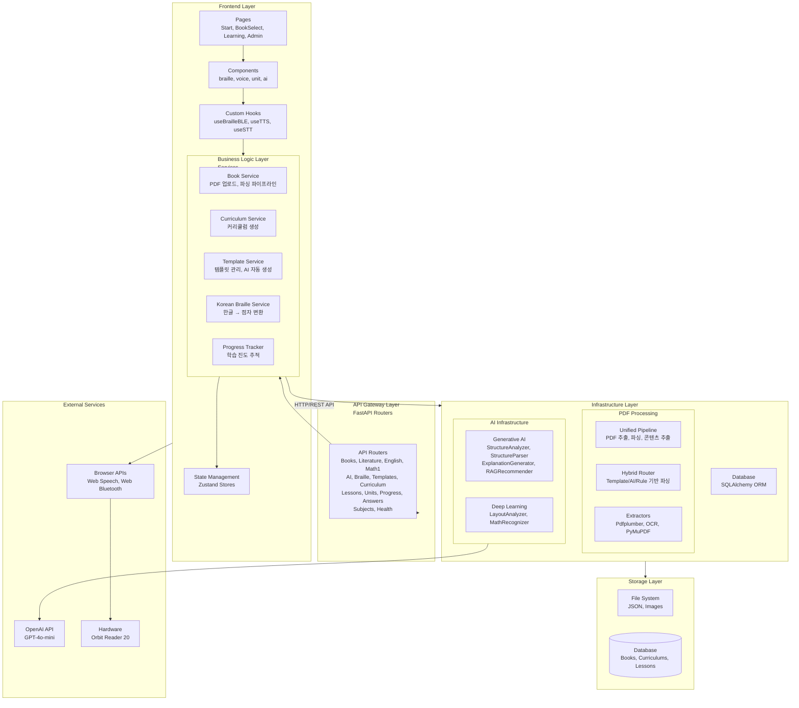
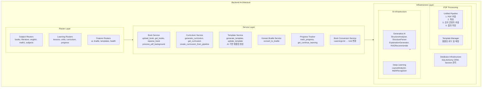
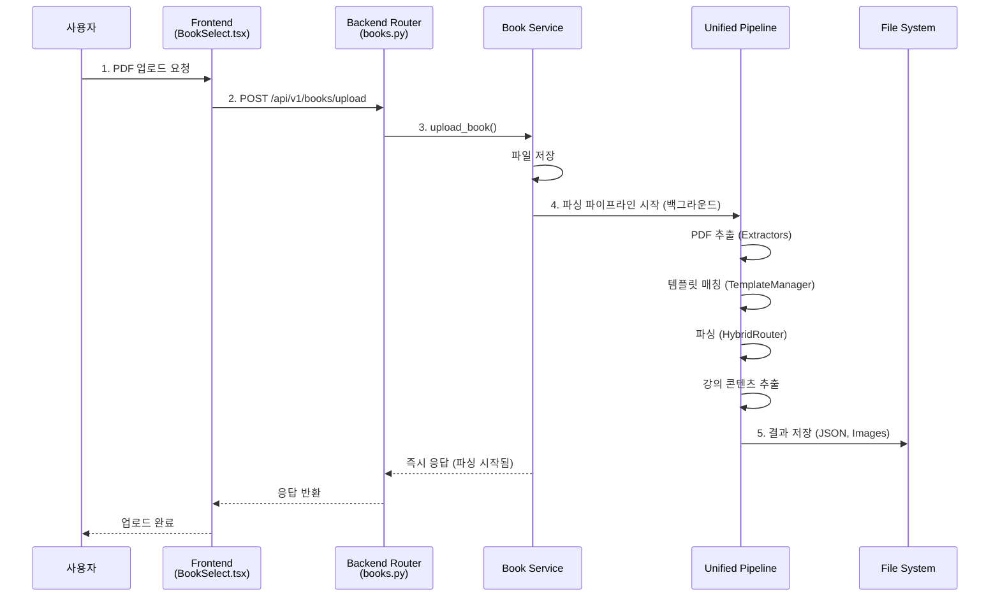
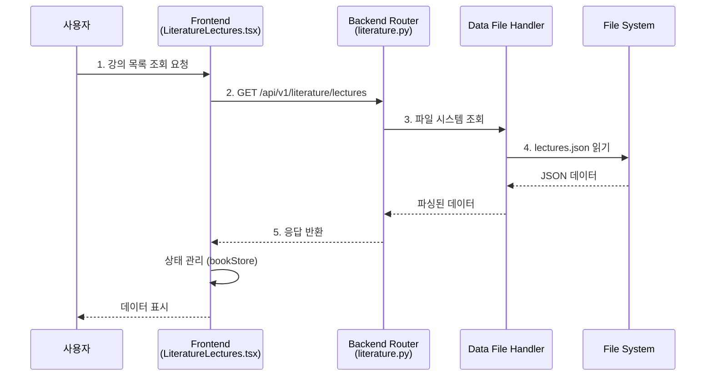
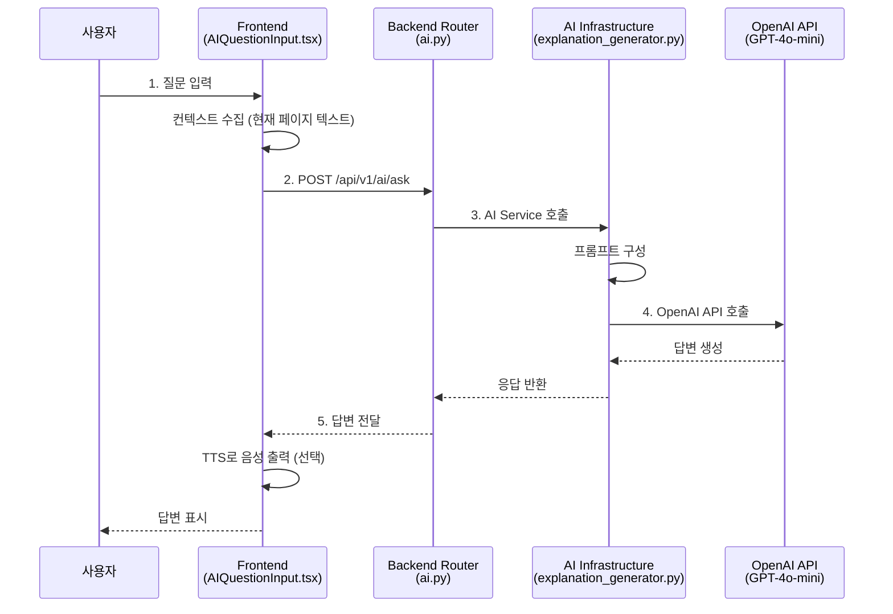
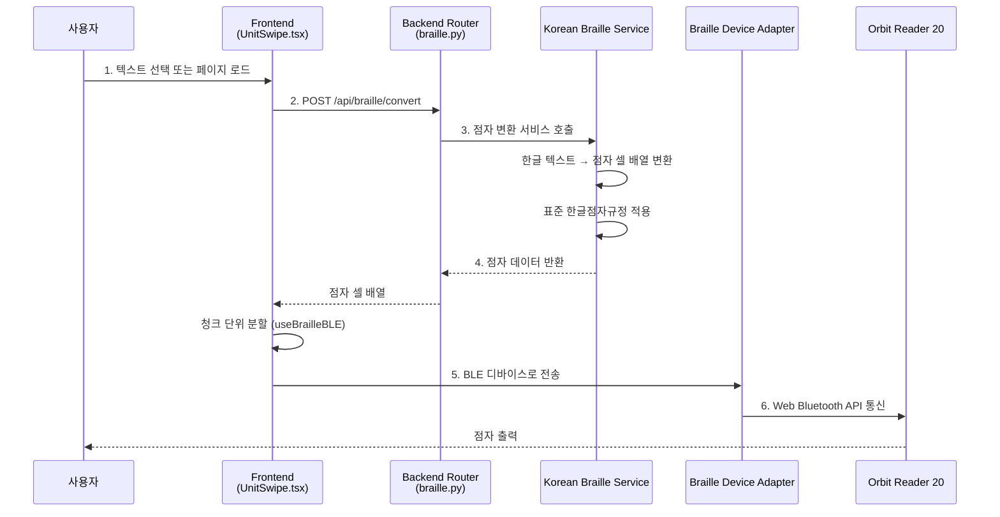
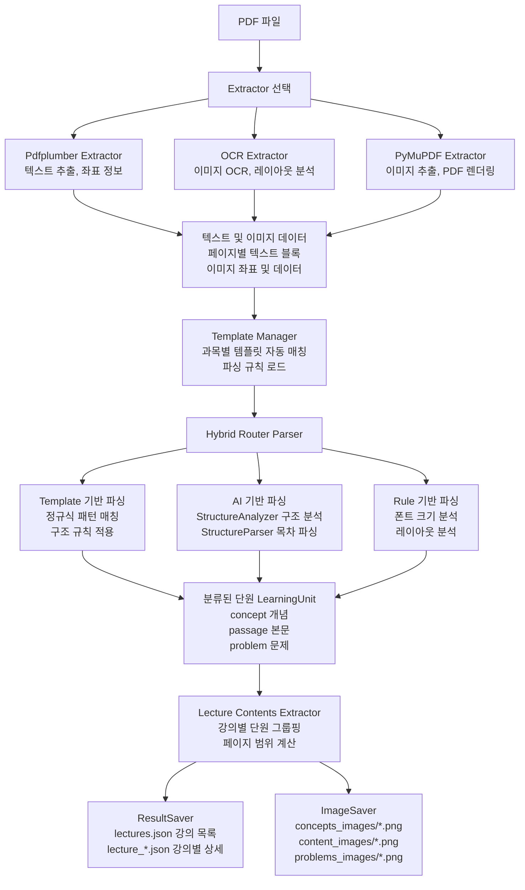
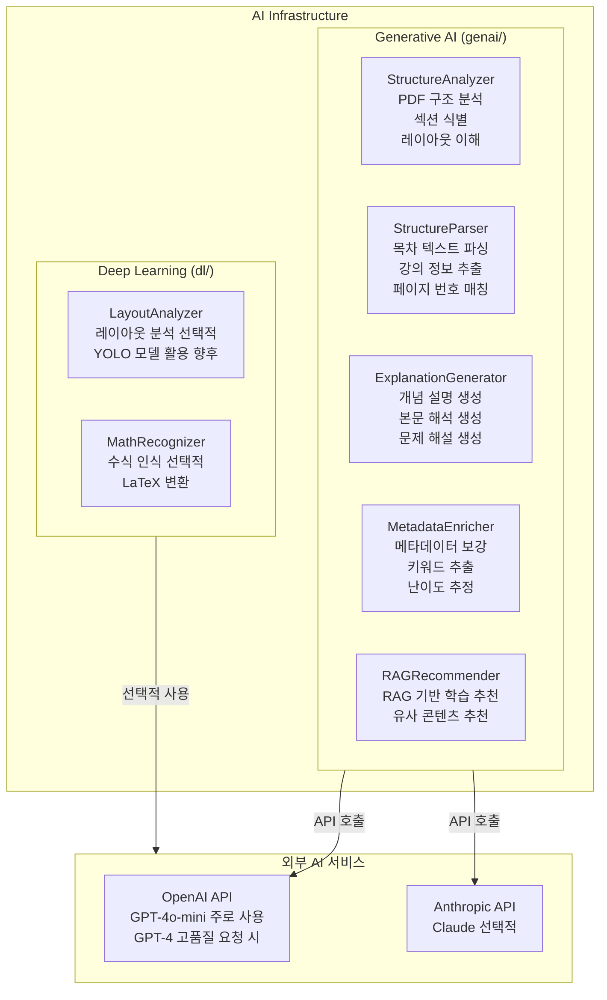

# 점그리 수능 도우미 - 시스템 아키텍처 (포트폴리오 버전)

**작성일**: 2026년 1월 28일  
**버전**: 2.0.0  
**프로젝트**: 점그리 수능 도우미 (Jeomgeuli Suneung Helper)

---

## 1. 전체 시스템 아키텍처



---

## 2. 프론트엔드 아키텍처

```mermaid
graph TD
    subgraph Frontend["Frontend Architecture"]
        subgraph Presentation["Presentation Layer"]
            Start[Start Page]
            BookSelect[BookSelect Page]
            LearningSummary[Learning Summary]
            LiteratureLectures[Literature Lectures]
            EnglishLectures[English Lectures]
            Math1Lectures[Math1 Lectures]
            UnitSwipe[Unit Swipe 학습]
            Admin[Admin Page]
        end
        
        subgraph Components["Component Layer"]
            BrailleComp[Braille Components<br/>BrailleCell, BrailleGrid, ChunkNavigation]
            VoiceComp[Voice Components<br/>VoiceFirstDisplay, MicButton]
            UnitComp[Unit Components<br/>UnitViewer, ConceptViewer, WorkViewer]
            AIComp[AI Components<br/>AIQuestionInput, RAGRecommendationCard]
            AdminComp[Admin Components<br/>TemplateManager, TOCTemplateWizard]
        end
        
        subgraph Hooks["Custom Hooks Layer"]
            useBraille[useBrailleBLE<br/>점자 디스플레이 BLE 연동]
            useBrailleChunk[useBrailleChunkReader<br/>점자 청크 읽기]
            useTTS[useTTS<br/>음성 합성]
            useSTT[useSTT<br/>음성 인식]
            useUnit[useUnitData<br/>단원 데이터 관리]
            useUnitNav[useUnitNavigation<br/>단원 네비게이션]
            useVoice[useVoiceCommands<br/>음성 명령 처리]
            useAI[useAILearningAssistant<br/>AI 학습 도우미]
        end
        
        subgraph Service["Service Layer"]
            APIClient[API Client<br/>HTTP 요청/응답 처리]
            SubjectSvc[Subject Services<br/>literature, english, math1]
            AISvc[AI Service<br/>질의응답, 설명 생성]
            VoiceSvc[Voice Service<br/>WebSpeechSTT/TTS]
        end
        
        subgraph State["State Management"]
            BookStore[bookStore<br/>교재 및 강의 목록]
            ProgressStore[progressStore<br/>학습 진도]
            LessonStore[lessonStore<br/>현재 학습 중인 강의]
            LiteratureProgress[literatureProgressStore<br/>문학 진도]
            VoiceStore[voice.ts<br/>음성 인터페이스 상태]
            LearnStore[learnStore<br/>학습 상태]
        end
        
        subgraph Utils["Utility Layer"]
            BrailleUtils[Braille Utils<br/>Device Adapters]
            TextUtils[Text Utils<br/>markdownToPlainText, sectionMatcher]
            VoiceUtils[Voice Utils<br/>commands, matchers, normalizers]
        end
    end
    
    Presentation --> Components
    Components --> Hooks
    Hooks --> Service
    Service --> State
    Service --> Utils
```



---

## 3. 백엔드 아키텍처



---

## 4. 데이터 흐름도

### 4.1 PDF 업로드 및 파싱 흐름



### 4.2 학습 데이터 조회 흐름



### 4.3 AI 질의응답 흐름



### 4.4 점자 변환 및 디스플레이 출력 흐름



---

## 5. 주요 컴포넌트 상세

### 5.1 PDF 파싱 파이프라인



### 5.2 AI 통합 구조



### 5.3 점자 변환 시스템

```mermaid
flowchart TD
    Input[한글 텍스트 입력]
    
    Input --> Preprocess[1. 텍스트 전처리<br/>공백 정규화<br/>특수문자 처리]
    
    Preprocess --> JamoSplit[2. 한글 자모 분리<br/>초성, 중성, 종성 분리<br/>유니코드 기반 자모 추출]
    
    JamoSplit --> BrailleMapping[3. 점자 셀 매핑<br/>표준 한글점자규정 적용<br/>초성/중성/종성 점자 매핑]
    
    BrailleMapping --> Abbreviation[4. 약자 처리<br/>약자 규칙 적용]
    
    Abbreviation --> NumberEnglish[5. 숫자/영문 처리<br/>숫자 점자 변환<br/>영문 점자 변환]
    
    NumberEnglish --> Output[점자 셀 배열 출력<br/>[1,0,0,0,0,0], [1,1,0,0,1,0], ...]
    
    Output --> Frontend[Frontend useBrailleBLE.ts<br/>점자 데이터 수신<br/>청크 단위 분할]
    
    Frontend --> Adapter[Braille Device Adapter]
    
    Adapter --> OrbitReader[OrbitReaderAdapter<br/>Orbit Reader 20 전용 프로토콜]
    Adapter --> GenericBLE[GenericBLEAdapter<br/>일반 BLE 점자 디스플레이 지원]
    
    OrbitReader --> Hardware[하드웨어 디바이스<br/>Orbit Reader 20<br/>점자 출력]
    GenericBLE --> Hardware
```

---

## 기술 스택 요약

### Frontend
- **프레임워크**: React 18.2.0 + TypeScript 5.3.3
- **빌드 도구**: Vite 5.0.8
- **스타일링**: Tailwind CSS 3.3.6
- **상태 관리**: Zustand 4.4.7
- **라우팅**: React Router 6.20.0
- **브라우저 API**: Web Speech API, Web Bluetooth API

### Backend
- **프레임워크**: FastAPI 0.104.1
- **언어**: Python 3.11
- **ORM**: SQLAlchemy 2.0.23
- **검증**: Pydantic 2.12.5
- **PDF 처리**: pdfplumber, PyMuPDF, OCR
- **AI**: OpenAI API, Anthropic API, LangChain

### Database
- **개발**: SQLite
- **프로덕션**: PostgreSQL (향후)

### 배포
- **플랫폼**: Render
- **Frontend**: Static Site Hosting
- **Backend**: Web Service

---

**문서 작성 완료**
